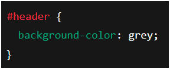

<hr height="2px" style="background-color: #fff;">

# Table of Contents

-   [Tier Technology](#tier-technology)
    -   [What is 1-tier architecture?](#what-is-1-tier-architecture)
    -   [What is 2-tier architecture?](#what-is-2-tier-architecture)
    -   [What is 3-tier architecture?](#what-is-3-tier-architecture)
    -   [What is n-tier architecture?](#what-is-n-tier-architecture)
    -   [Summary all tiers (in simple words)](#summary-all-tiers-in-simple-words)
    -   [How tier technology functions inside the architectural framework of a web application?](#how-tier-technology-functions-inside-the-architectural-framework-of-a-web-application)
    -   [Pitfalls of 3-tier technology compared to n-tier technology](#pitfalls-of-3-tier-technology-compared-to-n-tier-technology)
-   [CSS](#css)
    -   [What is CSS?](#what-is-css)
    -   [Methods of using CSS on a web page](#methods-of-using-css-on-a-web-page)
    -   [When to use each methods of CSS?](#when-to-use-each-methods-of-css)
    -   [Css box model](#css-box-model)
    -   [Font related attributes in css](#font-related-attributes-in-css)
    -   [Different Selectors in CSS](#different-selectors-in-css)
    -   [Final Summary Table](#final-summary-table)
-   [XML](#xml)
    -   [What is XML?](#what-is-xml)
    -   [Key Features of XML](#key-features-of-xml)
    -   [Where is XML used?](#where-is-xml-used)
    -   [Limitations of XML](#limitations-of-xml)
    -   [What is a Well-formed XML?](#what-is-a-well-formed-xml)
    -   [Rules for Well-formed XML](#rules-for-well-formed-xml)
    -   [What is DTD?](#what-is-dtd)
    -   [What happens if XML doesn't follow DTD rules?](#what-happens-if-xml-doesnt-follow-dtd-rules)
    -   [What is XML Schema?](#what-is-xml-schema)
    -   [What is Namespace in XML?](#what-is-namespace-in-xml)
-   [HTML](#html)
    -   [What is an Image Map?](#what-is-an-image-map)
    -   [How Image map work in HTML?](#how-image-map-work-in-html)
    -   [Form-related Tags in HTML](#form-related-tags-in-html)
    -   [Important form attributes](#important-form-attributes)
    -   [What is a Frame in HTML?](#what-is-a-frame-in-html)
    -   [Limitations and Disadvantages of Frames](#limitations-and-disadvantages-of-frames)
-   [PHP Login system](#php-login-system)
    -   [Signup](#signup)
    -   [Login](#login)
    -   [Homepage](#homepage)
    -   [Logout](#logout)

<hr height="2px" style="background-color: #fff;">

# Tier Technology

## What is 1-tier architecture?

It is the **simplest architecture**, where **everything runs in a single layer/system**.

🔹 **All components (UI, logic, data)** are part of **one program or one machine**.
🔹 It **does not require a network** because all processing happens **in single machine itself**.


_Fig: 1 tier technology_

### ⚙️ 🔷 Characteristics

1.  **Single environment**
    -   UI, business logic, and data are all in the **same application**.
2.  **Standalone applications**
    -   No need for a server or internet connection.
3.  **Low complexity**
    -   Easy to develop and deploy.
4.  **Data storage is local**
    -   Uses files or local databases within the same machine.
5.  **Limited scalability**
    -   Only one user or a few local users can use it.

### 📝 🔷 Examples

1.  **MS Excel**
    -   Everything (UI, calculation logic, data storage in .xlsx files) is in **one application on your computer**.
2.  **Notepad or any text editor**
    -   UI to type, logic to edit/save, and data stored in your local files, all handled by **the same program**.

✔️ **Other examples:**

-   Calculator app
-   Simple offline games (like Solitaire)

### ✔️ 🔷 Advantages

1.  **Very fast for single user**
    -   No network delay as everything is local.
2.  **Easy to develop**
    -   No need to manage client-server communication.
3.  **Simple maintenance**
    -   Only one application to update.
4.  **Low cost**
    -   No server setup or hosting fees.

### ❌ 🔷 Disadvantages

1.  **Data not shared**
    -   Data is local to the user, cannot be accessed by others simultaneously.
2.  **Low security**
    -   Data is stored on local device, easy to lose or corrupt if device fails.
3.  **No remote access**
    -   Cannot be used from other computers without copying files.

### ⚠️ 🔷 Limitations

1.  **Scalability**
    -   Cannot support multiple users or large number of use cases.
2.  **Collaboration impossible**
    -   No real-time data sharing or teamwork capability.
3.  **Data integrity risks**
    -   If the device crashes, data may be lost without backups.

### 🎯 🔷 Summary (in simple words)

✅ **1-tier** is like your **calculator or Notepad**:

-   **Everything is in one place**
-   **Good for you alone**
-   **Not useful for teamwork or online services**

---

## What is 2-tier architecture?

✅ In **2-tier architecture**, the application is divided into **two layers**:

1.  **Client (Presentation tier / presentation layer)**
    -   Where the user interacts with the application (UI).
    -   Sends requests to the server.
2.  **Server (Data tier / Database server / database layer)**
    -   Stores and manages data.
    -   Processes requests coming from the client.

🔹 The **business logic** can be on the **client-side** or **partially on server-side**.


_Fig: 2 tier architecture_

### ⚙️ 🔷 Characteristics

1.  **Two layers**
    -   Client (UI + some logic)
    -   Server (Database)
2.  **Direct communication**
    -   Client connects directly to the database server without an intermediate application server.
3.  **Network-based**
    -   Uses LAN or Internet to connect client and server.
4.  **Faster than 3-tier in small setups**
    -   Because no intermediate layer exists.

### 📝 🔷 Examples

1.  **Client-Server Database Application**
    -   **Example:** **MS Access connected to SQL Server**
        -   Frontend built with Access Forms (UI + logic)
        -   Database stored in SQL Server.
2.  **Library Management System in colleges**
    -   **Frontend:** Software installed in library computers (issue/return books UI + logic)
    -   **Backend:** Central database storing all records.

✔️ **Other examples:**

-   Simple banking software (old core banking apps)
-   Desktop apps connecting directly to database servers.

### ✅ 🔷 Advantages

1.  **Better data sharing**
    -   Multiple clients can access and share data from the central server.
2.  **Improved security compared to 1-tier**
    -   Database is on server, not stored locally on each client.
3.  **Easy maintenance**
    -   Database maintenance is centralized.
4.  **Faster development**
    -   Only two layers to manage, simpler than 3-tier.

### ❌ 🔷 Disadvantages

1.  **Scalability issues**
    -   As the number of clients increases, server load increases directly.
2.  **Potential Performance issues**
    -   Server may become slow if too many clients access it simultaneously.
3.  **Reduced Maintainability:**
    -   Changes in database schema may require client application changes too.
4.  **Limited security**
    -   Clients connect directly to the database; if client security is weak, database is exposed.
5.  **Centralized Database:**
    -   In a two-tier setup, the database is often centralized. If the server goes down or experiences issues, the entire application becomes unavailable, impacting all users.

### ⚠️ 🔷 Limitations

1.  **Difficult to handle business logic centrally**
    -   Logic split between client and database makes maintenance complex as app grows.
2.  **Network dependency**
    -   Requires a reliable network connection between client and server.

### 🎯 🔷 Summary (in simple words)

✅ **2-tier** is like:

-   A **software installed in computers** of a library, directly connected to **central database server**.
-   **Client** handles UI and some logic, **server** stores data.

🔴 Good for small setups with limited users.
🔴 Not scalable for large web applications.

---

## What is 3-tier architecture?

✅ In **3-tier architecture**, the application is divided into **three separate layers**:

1.  **Presentation tier (Client)**
    -   The **UI** users see and interact with.
    -   Sends requests to the application server.
2.  **Application tier (Logic layer / Middle tier)**
    -   Contains **business logic**.
    -   Processes client requests and interacts with the database.
3.  **Data tier (Database server)**
    -   Stores and manages data.

🔹 **Each tier is independent**, running on the different machines.


_Fig: 3 tier architecture_

### ⚙️ 🔷 Characteristics

1.  **Three distinct layers**
    -   UI (presentation)
    -   Business logic (application)
    -   Database (data)
2.  **Independent logic**
    -   Layers are independent; changes in one don't heavily affect others.
3.  **Better scalability and maintainability**
    -   You can upgrade one layer without affecting others.
4.  **Improved security**
    -   Client cannot access database directly, application server controls data access.
5.  **Supports distributed deployment**
    -   Each tier can be on separate servers for performance and security.

### 📝 🔷 Examples

1.  **Typical Web Application**
    -   **Frontend:** HTML, CSS, JavaScript running in browser.
    -   **Backend (application server):** Node.js, Django, or PHP handling logic.
    -   **Database:** MySQL, PostgreSQL storing data.
2.  **Online Banking System**
    -   **Presentation tier:** Banking app or website.
    -   **Application tier:** Banking logic server processing transactions.
    -   **Data tier:** Central database storing customer data, balances, transactions.

✔️ **Other examples:**

-   E-commerce sites (Amazon)
-   Social media apps (Instagram, Facebook)

### ✅ 🔷 Advantages

1.  **High scalability**
    -   Each tier can be scaled independently based on load.
2.  **Better security**
    -   Database is protected from direct user access; application server acts as gatekeeper.
3.  **Easy maintenance and updates**
    -   Update business logic or database without changing frontend.
4.  **Improved performance**
    -   Application server handles processing, reducing client load.
5.  **Reusability**
    -   Application logic can serve multiple types of clients (web, mobile apps).

### ❌ 🔷 Disadvantages

1.  **Increased complexity**
    -   More layers to manage and integrate.
2.  **Higher cost**
    -   Requires separate servers for each tier in large deployments.
3.  **Network latency**
    -   More layers mean more communication delays, potentially slowing down response time if not optimized.

### ⚠️ 🔷 Limitations

1.  **Requires skilled developers**
    -   More knowledge needed to build and integrate all tiers effectively.
2.  **Setup and deployment complexity**
    -   Needs proper configuration of each tier to communicate securely and efficiently.
3.  **Overhead for small applications**
    -   For simple apps, 3-tier may be overkill compared to 2-tier.

### 🎯 🔷 Summary (in simple words)

✅ **3-tier** is like:

-   **Frontend:** Your Instagram app's UI.
-   **Backend:** Instagram server processing posts, likes, comments.
-   **Database:** Stores all user data and posts securely.

🔴 **Best for web and large applications** due to its scalability, security, and maintainability.

---

## What is n-tier architecture?

✅ **n-tier architecture** extends beyond 3-tier by adding **more specialized layers (tiers)** to handle different responsibilities.
✅ Here, **"n" means any number of tiers** depending on the complexity and needs of the application.


_Fig: N-tier architecture_

### ⚙️ 🔷 Characteristics

1.  **Multiple layers (n layers)**
    -   Includes **presentation, application, and data tiers**, plus additional specialized tiers like:
    -   **API Gateway tier**
    -   **Authentication tier**
    -   **Caching tier**
    -   **Load balancing tier**
    -   **Reporting or analytics tier**
2.  **Highly modular**
    -   Each tier performs a **dedicated function**.
3.  **Distributed deployment**
    -   Tiers can run on different servers, containers, or cloud services.
4.  **Loose coupling and high separation of concerns**
    -   Changes in one tier minimally affect others.
5.  **High availability and fault tolerance**
    -   Due to separation and distributed design, failure in one tier does not crash the entire system.

### 📝 🔷 Examples

1.  **Large-scale E-commerce Website (like Amazon)**
    -   **Presentation tier:** Website frontend (React, Angular).
    -   **Web tier:** Handles web server logic, routing requests.
    -   **Application tier:** Business logic servers (Java, Node.js).
    -   **API Gateway tier:** Manages APIs, security, and rate limiting.
    -   **Caching tier:** Redis or Memcached to store frequent data for fast access.
    -   **Data tier:** Databases (MySQL, DynamoDB).
    -   **Analytics tier:** For recommendations, sales analytics, user behaviour tracking.
2.  **YouTube System**
    -   **Presentation tier:** Web or mobile app UI.
    -   **CDN tier:** Content Delivery Network to serve videos quickly worldwide.
    -   **Application tier:** Backend servers managing video uploads, user sessions.
    -   **Streaming tier:** Specialized servers optimized for video streaming.
    -   **Database tier:** Stores user data, video metadata.
    -   **Analytics tier:** Tracks views, likes, suggestions.

### ✅ 🔷 Advantages

1.  **Extreme scalability**
    -   Each tier can be scaled independently based on load.
2.  **Best security**
    -   Sensitive operations (e.g., authentication, payments) are handled by dedicated secure tiers.
3.  **High performance**
    -   Caching and CDN tiers reduce latency for users globally.
4.  **Flexibility**
    -   Easier to integrate new services or technologies into specific tiers.
5.  **Maintenance efficiency**
    -   Each tier is developed, updated, and maintained independently.
6.  **Fault tolerance and availability**
    -   System continues running even if some tiers face temporary issues.

### ❌ 🔷 Disadvantages

1.  **Very high complexity**
    -   Requires expert-level design, development, and deployment planning.
2.  **Expensive**
    -   Needs multiple servers, cloud services, and advanced infrastructure.
3.  **Longer development time**
    -   More tiers = more integration points to develop and test.
4.  **Network dependency**
    -   Heavy reliance on fast, secure networking between tiers.

### ⚠️ 🔷 Limitations

1.  **Difficult for small teams**
    -   Managing n-tier architecture requires dedicated DevOps, backend, frontend, and security experts.
2.  **Latency issues if not optimized**
    -   More tiers add potential delays if communication is not optimized.
3.  **Monitoring complexity**
    -   Requires advanced monitoring tools to track performance and errors across tiers.

### 🎯 🔷 Summary (in simple words)

✅ **n-tier** is like:

-   A **huge mall** where:
    -   Entrance gates (load balancer tier) control visitor flow.
    -   Security desks (auth tier) verify IDs.
    -   Shops (application tier) sell products.
    -   Cash counters (payment tier) handle transactions.
    -   Warehouses (database tier) store goods.
    -   Customer service desk (analytics tier) helps with queries.

🔴 **Best for big companies** (e.g. Google, Amazon, Netflix) needing **speed, security, reliability, and scalability**.

---

## Summary all tiers (in simple words)

✅ **1-tier** is like your **calculator or Notepad**:

-   **Everything is in one place**
-   **Good for you alone**
-   **Not useful for teamwork or online services**

✅ **2-tier** is like:

-   A **software installed in computers** of a library, directly connected to a **central database server**.
-   **Client** handles UI and some logic, **server** stores data.
-   🔴 Good for small setups with limited users.
-   🔴 Not scalable for large web applications.

✅ **3-tier** is like:

-   **Frontend:** Your Instagram app's UI.
-   **Backend:** Instagram server processing posts, likes, comments.
-   **Database:** Stores all user data and posts securely.
-   🔴 **Best for web and large applications** due to its scalability, security, and maintainability.

✅ **n-tier** is like:

-   A **huge mall** where:
    -   Entrance gates (load balancer tier) control visitor flow.
    -   Security desks (auth tier) verify IDs.
    -   Shops (application tier) sell products.
    -   Cash counters (payment tier) handle transactions.
    -   Warehouses (database tier) store goods.
    -   Customer service desk (analytics tier) helps with queries.
-   🔴 **Best for big companies** (e.g. Google, Amazon, Netflix) needing **speed, security, reliability, and scalability**.

---

## How tier technology functions inside the architectural framework of a web application?

### Understanding First

✅ **Web application** = A program accessed via web browsers (e.g., Facebook, Amazon, Instagram).
✅ It follows **tiered architecture** to organise its components and handle requests efficiently.

### ⚙️ 🔷 How do tiers function in a web application?

Let's see **step by step**, taking **3-tier architecture** as an example:

#### 📝 1. Presentation Tier (Client/Frontend)

🔹 **What it does:**

-   Provides the **user interface (UI)** that users see in their browsers.
-   Sends requests to the backend (application server) when users interact.
    🔹 **Examples:**
-   HTML, CSS, JavaScript files loaded in browser.
-   React, Angular, Vue apps.
    🔹 **Function:**
-   **Collects user input** (e.g., login details, form data).
-   Displays **responses received** from backend (e.g., dashboard data, profile info).

#### 📝 2. Application Tier (Business Logic / Backend)

🔹 **What it does:**

-   Acts as a **middleman between frontend and database**.
-   Processes requests from the frontend.
    🔹 **Examples:**
-   Node.js, Django, Spring Boot, PHP server-side code.
    🔹 **Function:**

1.  **Receives request** from frontend (e.g., user wants to see their posts).
2.  **Processes logic** (e.g., check user session, apply filters).
3.  **Fetches data** from database tier if needed.
4.  **Sends back response** to frontend.

#### 📝 3. Data Tier (Database)

🔹 **What it does:**

-   Stores **application data permanently**.
    🔹 **Examples:**
-   MySQL, PostgreSQL, MongoDB.
    🔹 **Function:**
-   **Receives queries** from application tier.
-   **Returns results** (e.g., user data, product lists).
-   **Stores new data** when users add or update something.

### 🔄 🔷 Overall Flow in Web Application

Here's how **tiers function together** when you use a web app:

1.  **User** types `Facebook.com` → browser (presentation tier) loads UI.
2.  **User logs in**, entering username and password → frontend sends data to **application tier (backend server)**.
3.  **Application tier** processes:
    -   Checks if user exists in **database tier**.
    -   Validates password.
4.  **Database tier** sends user data back to **application tier**.
5.  **Application tier** sends a **response to frontend** to display the news feed.

✅ **Each tier performs its job independently**, but works together to provide smooth service to users.

### 🔧 🔷 Why is this separation (tiering) needed?

✔️ **Better security**

-   Frontend cannot directly access database. Backend controls access.
    ✔️ **Scalability**
-   Each tier can be scaled (more servers) based on demand.
    ✔️ **Maintainability**
-   Changes in UI do not affect backend or database structure.
    ✔️ **Performance optimization**
-   Caching tiers, load balancers, or API gateways can be added (n-tier) to improve performance.

### 🎯 🔷 Final Summary

✅ **Tier technology in web apps functions by dividing responsibilities** into layers:

-   **Presentation tier:** UI for user interaction.
-   **Application tier:** Logic and processing.
-   **Data tier:** Storing and managing data.
    👉 Each tier **communicates with the next tier** to handle user requests efficiently, securely, and in an organized manner within the **architectural framework** of modern web applications.

---

## Pitfalls of 3-tier technology compared to n-tier technology

| Aspect          | 3-tier Technology                     | n-tier Technology                   |
| --------------- | ------------------------------------- | ----------------------------------- |
| **Structure**   | Presentation, Application, Data tiers | Multiple specialized tiers beyond 3 |
| **Scalability** | Limited                               | High scalability                    |
| **Complexity**  | Moderate                              | High                                |
| **Flexibility** | Limited to 3 layers                   | Highly modular and flexible         |
| **Cost**        | Lower                                 | Higher due to more layers           |

### Pitfalls of 3-tier Technology

1.  **Limited Scalability**

    -   As traffic increases, the application server becomes a bottleneck because there are **no separate caching, API gateway, or load balancing tiers** to distribute requests efficiently.
    -   In **n-tier**, load balancers distribute traffic, preventing bottlenecks.

2.  **Performance Bottleneck**

    -   Heavy processing tasks (analytics, reporting) in the application tier can slow down user requests. There are no dedicated tiers for specific tasks.
    -   In **n-tier**, specialized tiers handle tasks efficiently, such as a caching tier for frequent data.

3.  **Less Flexibility**

    -   Adding new functionalities (e.g., AI, recommendation engines) requires **modifying existing tiers**, increasing the risk of bugs.
    -   In **n-tier**, new services can be added as separate tiers without affecting existing ones.

4.  **Maintenance Challenges at Scale**

    -   Any major change in application logic affects the entire application tier, as it handles **all business processes together**.
    -   In **n-tier**, updates and patches are tier-specific, reducing system-wide risks.

5.  **Security Limitations**
    -   If the application tier is compromised, database access is at risk because no additional security tier is present.
    -   In **n-tier**, dedicated security tiers or authentication gateways protect the application and data tiers from direct exposure.

### Limitations of n-tier technology despite its advantages

However, **n-tier** also has pitfalls compared to 3-tier:

-   **Higher Complexity:** Needs expert management, deployment strategies, and monitoring.
-   **More Expensive:** Infrastructure cost increases with more servers and services.
-   **Latency Risks:** Multiple tiers introduce potential delays if communication is not optimized.

### Final Analysis Summary

✅ **3-tier pitfalls compared to n-tier:**

-   Limited scalability
-   Bottlenecks in the application tier
-   Less flexibility for future growth
-   Weaker security compared to n-tier's specialized tiers

🔴 **But** for small to medium apps, **3-tier is simpler and cost-effective**.
🔴 **n-tier is suited for large-scale, enterprise-level applications** requiring high performance, security, and modularity.

---

Of course! Here are the "CSS" and "XML" sections beautifully formatted as requested.

---

# CSS

## What is CSS?

✅ **CSS** stands for **Cascading Style Sheets**.
✅ It is used to **style and design web pages** made with HTML.

🔹 **HTML** is like the **skeleton** (structure).
🔹 **CSS** is like the **clothes and decorations** (colors, fonts, layout).

### ✨ 🔷 Why use CSS?

✔️ To make websites **attractive and user-friendly**.
✔️ To control the **look and feel** of multiple pages efficiently.
✔️ To separate **content (HTML)** from **design (CSS)** for better maintenance.

---

## Methods of using CSS on a web page

There are **three methods**:

### 1. Inline CSS

✅ **Definition:**
CSS is written **directly inside HTML tags** using the `style` attribute.

✅ **Example:**

```html
<p style="color: blue; font-size: 18px;">
	This is a blue paragraph with inline CSS.
</p>
```

### 2. Internal CSS (Embedded CSS)

✅ **Definition:**
CSS is written **inside the `<style>` tag** in the `<head>` section of the HTML page.

✅ **Example:**


### 3. External CSS

✅ **Definition:**
CSS is written in a **separate `.css` file** and linked to HTML using the `<link>` tag.

✅ **Example:**

**HTML File (index.html):**


**CSS File (styles.css):**


---

## When to use each method of CSS?

-   **Inline CSS:**

    -   For **quick styling** of single elements.
    -   When styles are small and need to be applied to a small part only.

-   **Internal CSS:**

    -   When styling **only one page**.
    -   Keeps CSS and HTML together in a single file.

-   **External CSS:**
    -   **When styles need to be reused across multiple pages.** This is the most common and recommended method.

---

## CSS Box Model

The CSS Box Model is the foundation of layout in CSS. Every HTML element is considered a rectangular box, made up of the following layers (from innermost to outermost):

1.  **Content** -- The actual text or image.
2.  **Padding** -- Space between the content and the border.
3.  **Border** -- The edge around the padding.
4.  **Margin** -- Space outside the border, separating the element from others.

**Example:**


---

## Font-related attributes in CSS

| Property             | Description (Simple)                    | Example Use                       |
| -------------------- | --------------------------------------- | --------------------------------- |
| **`font-family`**    | Sets the **type of font** to use.       | `font-family: Arial, sans-serif;` |
| **`font-size`**      | Sets the **size of text**.              | `font-size: 16px;`                |
| **`font-weight`**    | Sets **boldness or thickness** of text. | `font-weight: bold;`              |
| **`font-style`**     | Sets **style like normal, italic**.     | `font-style: italic;`             |
| **`font-variant`**   | Displays text in **small-caps**.        | `font-variant: small-caps;`       |
| **`font`**           | **Shorthand** for multiple properties.  | `font: italic bold 16px Arial;`   |
| **`line-height`**    | Sets **space between lines** of text.   | `line-height: 1.5;`               |
| **`letter-spacing`** | Sets **space between letters**.         | `letter-spacing: 2px;`            |
| **`word-spacing`**   | Sets **space between words**.           | `word-spacing: 5px;`              |
| **`text-transform`** | Changes **case of text**.               | `text-transform: uppercase;`      |

---

## Different Selectors in CSS

### 1. Type Selector (Element Selector)

> ✅ **What it does:** Selects all elements of a **given type/tag name**.
>
> 📠**Example:** > > \* **Explanation:** All `<p>` tags on the page will have **blue text color**.

### 2. Class Selector

> ✅ **What it does:** Selects all elements with a **specific class attribute**.
>
> 📝 **Syntax:** `.` + `classname`
>
> 📠**Example:** > 
>
> -   ✔️ **Explanation:** Any element with `class="intro"` will have an **18px font size**.

### 3. ID Selector

> ✅ **What it does:** Selects a **single unique element** with a specific ID attribute.
>
> 📝 **Syntax:** `#` + `idname`
>
> 📠**Example:** > 
>
> -   **Explanation:** The element with `id="header"` will have a **grey background**.

### 4. Universal Selector

> ✅ **What it does:** Selects **all elements on the page**.
>
> 📝 **Syntax:** `*`
>
> 📠**Example:** > 
>
> -   **Explanation:** Sets `margin` and `padding` to `0` for **all elements**.

### 5. Grouping Selector

> ✅ **What it does:** Applies the **same styles to multiple selectors**.
>
> 📝 **Syntax:** `selector1, selector2 { ... }`
>
> 📠**Example:** > 
>
> -   **Explanation:** Sets **Arial font** for all `<h1>`, `<h2>`, and `<p>` tags.

### 6. Descendant Selector

> ✅ **What it does:** Selects elements that are **inside another specific element**.
>
> 📝 **Syntax:** `parent child`
>
> 📠**Example:** > 
>
> -   ✔️ **Explanation:** All `<p>` tags **inside a `<div>`** will have green text.

### 7. Child Selector

> ✅ **What it does:** Selects elements that are **direct children only**.
>
> 📝 **Syntax:** `parent > child`
>
> 📠**Example:** > 
>
> -   ✔️ **Explanation:** Sets **square bullets** only for `<li>` items that are **direct children of `<ul>`**.

### 8. Attribute Selector

> ✅ **What it does:** Selects elements based on a **specific attribute or attribute value**.
>
> 📝 **Example:** > ![CSS code 'input[type="text"] { background-color: lightyellow; }'](./examples/media/image16.png)
>
> -   ✔️ **Explanation:** All `<input>` elements with `type="text"` will have a **light yellow background**.

---

## Final Summary Table

| Selector Type  | Syntax Example          | Selects                          |
| -------------- | ----------------------- | -------------------------------- |
| **Type**       | `p {}`                  | All `<p>` elements               |
| **Class**      | `.intro {}`             | Elements with `class="intro"`    |
| **ID**         | `#header {}`            | Element with `id="header"`       |
| **Universal**  | `* {}`                  | All elements                     |
| **Grouping**   | `h1, p {}`              | Both `<h1>` and `<p>`            |
| **Descendant** | `div p {}`              | `<p>` inside `<div>`             |
| **Child**      | `ul > li {}`            | Direct `<li>` children of `<ul>` |
| **Attribute**  | `input[type="text"] {}` | `<input>` with `type="text"`     |

---

# XML

## What is XML?

✅ **XML** stands for **eXtensible Markup Language**.
✅ It is used to **store and transport data** in a structured, readable format.

🔹 **Similar to HTML syntax**, but **purpose is different**:

-   **HTML:** Displays data (web pages).
-   **XML:** Stores and carries data (no display formatting).

### Key Features of XML

✔️ User-defined tags (not predefined like HTML).
✔️ Stores data in a **hierarchical (tree) structure**.
✔️ Both **human-readable and machine-readable**.
✔️ Platform-independent (works everywhere).
✔️ Strict syntax (every tag opened must be closed).

**Example of XML:**


-   **Explanation:**
    -   `<?xml version="1.0" encoding="UTF-8"?>`: Declares XML version and character encoding.
    -   `<school> ... </school>`: The root element enclosing all other data.
    -   `<student>...</student>`: Child elements containing the actual data.

### Where is XML used?

1.  **Data exchange between systems**
    -   _Example:_ Web services (APIs) use XML to transfer data.
2.  **Configuration files**
    -   _Example:_ `AndroidManifest.xml` in Android apps stores app configuration.
3.  **Storing data**
    -   _Example:_ Saving structured data like user lists or product catalogs.

### Limitations of XML

-   More **verbose (lengthy)** compared to alternatives like JSON.
-   Parsing is **slower** than lightweight formats.
-   Not used for displaying data like HTML.

---

## What is a Well-formed XML?

✅ An **XML document is called "well-formed"** if it **follows all the basic syntax rules of XML**.

🔹 In simple words:
👉 It is **correctly written XML** that an XML parser can read without errors.

### Rules for Well-formed XML

1.  **Must have a root element:** All XML data must be enclosed within a single **root tag**.
2.  **Properly nested tags:** Tags must be **closed in the correct order**.
3.  **All tags must be closed:** **Every opened tag must be closed**.
4.  **Case sensitivity:** XML tags are **case sensitive** (`<Name>` and `</name>` is an error).
5.  **Quotes for attribute values:** Attribute values must always be in **quotes (" ")**.

> **What if XML is not well-formed?**
>
> -   The XML parser will **throw an error**.
> -   The data cannot be read or processed.

---

## What is DTD?

> ✅ **DTD** stands for **Document Type Definition**.
> ✅ It defines the **structure and rules of an XML document**.
>
> 🔹 In simple words:
> 👉 **DTD acts like a blueprint or grammar book** for your XML.
> 👉 It tells what **tags can be used, their order, and attributes**.

**Why do we need DTD?**

> ✔️ To ensure XML documents are **valid** (follow the correct structure).
> ✔️ To maintain **consistency** in data when shared between systems.
> ✔️ Helps **parsers** check if XML data is as expected.

### Types of DTD

There are **two ways to apply a DTD**:

1.  **Internal DTD** (written inside the XML file itself).
2.  **External DTD** (written in a separate `.dtd` file and linked to the XML).

#### 1. Internal DTD (Step-by-step)

✅ **How to write it:**

-   Use `<!DOCTYPE>` at the top of your XML file.
-   Define the root tag and its structure inside it.


-   **Explanation (simple words):**
    -   `<!DOCTYPE student [...]>` tells the parser that the root element is `<student>`.
    -   `<!ELEMENT student (name, rollno, department)>`: The `<student>` tag must contain `name`, `rollno`, and `department` tags in this specific order.
    -   `<!ELEMENT name (#PCDATA)>`: The `<name>` tag contains parsed character data (text).

#### 2. External DTD (Step-by-step)

✅ **Why use it?**

-   When you have **many XML files using the same structure**.

✅ **How to write it:**

**Step 1: Create a DTD file (e.g., `student.dtd`)**


**Step 2: Link it in your XML file**


-   **Explanation (simple words):**
    -   `<!DOCTYPE student SYSTEM "student.dtd">` links the XML to the external DTD file `student.dtd`.
    -   The XML parser now uses the rules in `student.dtd` to check this XML.

### What happens if XML doesn't follow DTD rules?

❌ The parser will show an **error**, saying the XML is **not valid**.
✅ **Valid XML** = Well-formed XML + Follows DTD rules.

### Final Summary

✅ **DTD = A blueprint for XML structure**.
✅ **Two types:**

1.  **Internal DTD:** Written inside the XML file.
2.  **External DTD:** A separate file linked to the XML.
    🔵 Ensures XML data is **structured, predictable, and valid**.

Of course! Here are the remaining sections, beautifully formatted and ready to be added to your document.

---

## What is XML Schema?

✅ **XML Schema** defines the **structure and rules** for an XML document, just like **DTD**, but in a **more powerful and detailed way**.

🔹 It is also called **XSD** (**XML Schema Definition**).
🔹 **Written in XML syntax itself**, unlike DTD which has its own syntax.

### Why use XML Schema?

✔️ **Stronger data typing:** Can define data types (e.g., string, integer, date).
✔️ **More detailed validation:** Can set rules like minimum/maximum values, string length, or patterns.
✔️ **Namespace support:** Handles multiple schemas for complex documents.
✔️ **Written in XML syntax:** Easier for tools and parsers to read and validate.

### Example of XML Schema

**1. XML file (`student.xml`)**


**2. XML Schema file (`student.xsd`)**


-   **Explanation (simple words):**
    1.  **`student.xml`**:
        -   Uses `xsi:noNamespaceSchemaLocation="student.xsd"` to link to its schema file.
    2.  **`student.xsd`**:
        -   **Defines:**
            -   **Root element:** `student`
            -   **Child elements:**
                -   `name` as a `string`
                -   `rollno` as an `integer`
                -   `department` as a `string`

---

### DTD vs. XML Schema (XSD)

| Feature           | DTD                  | XML Schema (XSD)                            |
| ----------------- | -------------------- | ------------------------------------------- |
| **Syntax**        | **Not XML syntax**   | **XML syntax**                              |
| **Data types**    | **Limited** (PCDATA) | **Strong typing** (string, int, date, etc.) |
| **Namespaces**    | **No support**       | **Supports namespaces**                     |
| **Extensibility** | **Less extensible**  | **Highly extensible**                       |

---

### Final Summary

✅ **XML Schema (XSD)** is an advanced way to define the structure and data types of XML documents.
✅ It is written in XML syntax, supports data validation, namespaces, and detailed rules, making it powerful for modern data exchange systems.

---

## What is Namespace in XML?

✅ **A Namespace in XML is a way to avoid naming conflicts when using similar tag names from different sources.**

> 🔹 It gives unique identification to elements and attributes by using a URI (Uniform Resource Identifier).
> 🔹 It works like a "surname" for tags to differentiate between similar names.

### Why do we need XML Namespaces?

> Imagine two different XML documents using the same tag name `<table >`:
>
> 1.  One is for an **office table**.
> 2.  Another is for **home table data**.
>
> 🔴 If both are combined in one XML, it will confuse the parser.
> ✅ A namespace solves this by assigning unique prefixes to differentiate them.

**Example:**

_Now the issue is solved, and each `<table>` tag points to a specific item._

### Advantages of XML Namespaces

1.  **Avoids naming conflicts:** Same tag names from different sources can coexist.
2.  **Ensures data integrity:** Applications know exactly which tag belongs to which definition.
3.  **Supports modular design:** Combine data from multiple XML vocabularies easily.
4.  **Better integration:** Useful in web services and APIs that integrate data from different standards.
5.  **Improves readability:** Clear prefixes show the tag's context (e.g., `html:table` vs. `furniture:table`).

### 🔧 🔷 Importance of XML Namespaces

✔️ Crucial in real-world XML applications, such as:

-   **Web services (SOAP, XML APIs):** Combine multiple schemas safely.
-   **Large data integrations:** E-commerce XML combining product and order data.
-   **Standard compliance:** XML standards like SVG, XHTML, and SOAP use namespaces for their tags.

> **What if we don't use namespaces?**
>
> -   Tag name clashes will occur when combining different XML sources.
> -   Parsers and applications will not understand which tag belongs to which context, causing errors and data misinterpretation.

---

# HTML

## What is an Image Map?

Imagine you have **one picture**, but you want to make **different parts of that picture clickable**, leading to **different links** or actions.

✅ **For example:**

-   You have a picture of **Nepal's map**.
-   If someone clicks on the **Kathmandu area**, it goes to a page about Kathmandu.
-   If they click on the **Pokhara area**, it goes to a page about Pokhara.

This is called an **Image Map** because **different areas (parts) of the image are mapped to different links**.

## How Image Maps work in HTML

In simple words:

1.  You use an `` tag to display the image.
2.  You use a `<map>` tag to define the map of clickable areas.
3.  Inside `<map>`, you use `<area>` tags to define **which part is clickable** and **where it will go**.

**Simple Example:**


-   **Explanation:**
    -   **Define the image** as usual with the `` tag.
    -   **Add a `usemap` attribute** to it and provide the name of the map you want to use (the name must begin with `#`).
    -   **Use a `<map>` tag** to define the areas to make clickable.
    -   **The `<area>` tag** makes a specific area clickable:
        -   **`shape`**: The shape to click (e.g., `rect`, `circle`, `poly`).
        -   **`coords`**: The x and y coordinates of the shape on the image.
        -   **`href`**: The link where the user will go.
        -   **`alt`**: Alternate text for accessibility.

### Breaking it down:

✅ **`` tag:**

-   **Displays the image.**
-   `usemap="#nepalmap"` **connects it to the `<map>` below.**

✅ **`<map>` tag:**

-   **Defines the map of clickable areas.**
-   `name="nepalmap"` **gives it a name.**

✅ **`<area>` tags:**

-   **Define each clickable area.**
-   **`shape` can be:**
    -   `"rect"` for a rectangle (`x1,y1,x2,y2`)
    -   `"circle"` for a circle (`x,y,radius`)
    -   `"poly"` for a polygon (`x1,y1,x2,y2,...`)
-   **`coords`** are the coordinates that define the area.
-   **`href`** is the link to go to when clicked.
-   **`alt`** is the alternate text for accessibility.

### In simple words:

👉 **Image Map = One image + Multiple clickable areas.**
👉 You **define the shape** and **link** for each area.

---

## Form-related Tags in HTML

| Tag              | Purpose                              | Example Use                              |
| ---------------- | ------------------------------------ | ---------------------------------------- |
| **`<form>`**     | Creates a **form container**.        | `<form action="/submit" method="post">`  |
| **`<input>`**    | Creates **various input fields**.    | `<input type="text" name="username">`    |
| **`<label>`**    | Defines a **label for an input**.    | `<label for="email">Email:</label>`      |
| **`<textarea>`** | Creates a **multi-line text input**. | `<textarea name="message"></textarea>`   |
| **`<button>`**   | Creates a **clickable button**.      | `<button type="submit">Submit</button>`  |
| **`<select>`**   | Creates a **dropdown list**.         | `<select name="country"></select>`       |
| **`<option>`**   | Defines **options in a dropdown**.   | `<option value="NP">Nepal</option>`      |
| **`<fieldset>`** | Groups related form elements.        | `<fieldset>...</fieldset>`               |
| **`<legend>`**   | Defines a **title for a fieldset**.  | `<legend>Personal Info</legend>`         |
| **`<optgroup>`** | Groups options inside a select.      | `<optgroup label="Asia">...</optgroup>`  |
| **`<datalist>`** | Provides **predefined options**.     | `<datalist id="browsers">...</datalist>` |

## Common Input Types (using `<input>` tag)

-   `type="text"` ➔ Single-line text input
-   `type="password"` ➔ Password field (hidden input)
-   `type="email"` ➔ Validates email format
-   `type="number"` ➔ Number input with arrows
-   `type="date"` ➔ Date picker
-   `type="radio"` ➔ Single choice options
-   `type="checkbox"` ➔ Multiple choice options
-   `type="submit"` ➔ Submit button
-   `type="reset"` ➔ Reset form inputs
-   `type="file"` ➔ File upload field
-   `type="hidden"` ➔ Hidden data sent with the form

## Important Form Attributes

| Attribute          | Used On                           | Purpose                                    | Example Use                        |
| ------------------ | --------------------------------- | ------------------------------------------ | ---------------------------------- |
| **`action`**       | `<form>`                          | URL where form data is sent.               | `<form action="/submit">`          |
| **`method`**       | `<form>`                          | HTTP method: `GET` or `POST`.              | `<form method="post">`             |
| **`name`**         | Most form tags                    | Names the input for backend processing.    | `<input name="username">`          |
| **`type`**         | `<input>`                         | Specifies the input field type.            | `<input type="email">`             |
| **`value`**        | `<input>`, `<option>`             | Sets a default value.                      | `<input value="Utsav">`            |
| **`placeholder`**  | `<input>`, `<textarea>`           | Shows hint text in the input field.        | `<input placeholder="Enter name">` |
| **`required`**     | `<input>`, `<select>`             | Makes the field compulsory.                | `<input required>`                 |
| **`readonly`**     | `<input>`, `<textarea>`           | Makes the field uneditable but visible.    | `<input readonly>`                 |
| **`disabled`**     | Form elements                     | Disables input (unusable and unsubmitted). | `<input disabled>`                 |
| **`maxlength`**    | `<input>`, `<textarea>`           | Maximum characters allowed.                | `<input maxlength="10">`           |
| **`min`, `max`**   | `<input type="number">`           | Sets minimum and maximum values.           | `<input type="number" min="1">`    |
| **`checked`**      | `<input type="radio">`            | Sets the default selected state.           | `<input type="radio" checked>`     |
| **`multiple`**     | `<select>`, `<input type="file">` | Allows multiple selections.                | `<select multiple>`                |
| **`autocomplete`** | `<form>`, `<input>`               | Enables browser suggestions.               | `<input autocomplete="on">`        |

### Final Summary

> ✅ **Form tags:** `<form>`, `<input>`, `<label>`, `<textarea>`, `<button>`, `<select>`, `<option>`, etc.
> ✅ **Attributes:** control **data submission, validation, appearance, and usability** of forms.

---

## What is a Frame in HTML?

✅ A **Frame** is an old HTML feature used to divide the browser window into **multiple sections**, where **each section can load a different HTML document**.

🔹 Frames were created using the `<frameset>` and `<frame>` tags.
🔹 They allowed displaying **multiple web pages in a single browser window**.

**Example of a Frameset:**


-   **Explanation:**
    -   `cols="30%,70%"` divides the window into two vertical frames.
    -   **Left frame:** loads `menu.html` (takes 30% width).
    -   **Right frame:** loads `content.html` (takes 70% width).

### Limitations and Disadvantages of Frames

| Disadvantage                    | Explanation                                                      |
| ------------------------------- | ---------------------------------------------------------------- |
| **1. Poor user experience**     | Difficult to navigate and scroll within multiple frames.         |
| **2. Difficult to bookmark**    | Bookmarking only saves the frameset, not the specific content.   |
| **3. SEO problems**             | Search engines struggle to index framed content properly.        |
| **4. No longer supported**      | **HTML5 has deprecated frames.** They are obsolete.              |
| **5. Complex URL management**   | Each frame has its own URL, making linking confusing.            |
| **6. Printing issues**          | Printing often only prints the active frame, not the whole page. |
| **7. Security risks**           | Can be misused for clickjacking attacks.                         |
| **8. Responsive design issues** | Frames are not mobile-friendly and don't adapt to screen sizes.  |

### Final Summary

✅ **Frames** = Divide the browser into sections to display multiple pages.
❌ **Limitations:** Poor user experience, bad for SEO, outdated, security issues, not mobile-friendly.
🔴 **Modern web design uses `<iframe>`** for embedding content, but even that has limited use compared to responsive layouts with CSS and JavaScript.

---

# PHP Login System

#### IF you want Code for simple CRUD (Create, Read, Update, Delete) operations in PHP, please check out the [PHP CRUD Operations]("https://github.com/Utsav-56/web_guide/tree/main/php/Crud") section.

### Signup

[//]: # (![PHP code for a user signup system.]&#40;./examples/media/image26.png&#41;)

```php
<?php


// Creating a global variable constant for database connection
// It is same as doing $conn = mysqli_connect() 
// but using a define allows us to use it inside other functions.
define(__CONN, mysqli_connect("localhost", "root", "", "store"));

if (!__CONN) {
    die("Connection failed: " . mysqli_connect_error());
}

$message = '';

function main()
{
    if (!isset($_POST['submit'])) {
        return "";
    }

    // Check if all required fields are present
    if (!isset($_POST['username']) || !isset($_POST['email']) || !isset($_POST['password'])) {
        return "All fields are required.";
    }

    // Get the form data
    $username = trim($_POST['username']);
    $email = trim($_POST['email']);
    $password = trim($_POST['password']);


    // Validate password strength
    if (strlen($password) < 6) {
        return "Password must be at least 6 characters long.";
    }

    // Validate email
    if (!filter_var($email, FILTER_VALIDATE_EMAIL)) {
        return "Invalid email format.";
    }

    // Check if username already exists
    $sql = "SELECT * FROM users WHERE username = '$username' OR email = '$email'";
    $result = mysqli_query(__CONN, $sql);

    if (mysqli_num_rows($result) > 0) {
        return "Username already exists. Please choose a different one.";
    }

    // Insert into database
    $sql = "INSERT INTO users (username, email, password) VALUES ('$username', '$email', '$password')";
    $result = mysqli_query(__CONN, $sql);

    if (!$result) {
        return "Error inserting data.";
    }


    return "Data inserted successfully!";
}

$message = main();
?>
```
```html
<html>
<head><title>Signup</title></head>
<body>

<h2>Signup</h2>

<form method="post" action="">
  <label>Username:</label>
    <input type="text" name="username" required><br>

    <label>Email:</label>
    <input type="email" name="email" required><br>

    <label>Password:</label>
    <input type="password" name="password" required><br>

    <button type="submit" name="submit">Register</button>
</form>

<p><?php echo $message; ?></p>

</body>
</html>
```

Note: Both Html and php is in same file

<details>
<summary>Click to view the all in one code for Signup</summary>


</details>


### Login

```php
 <?php


// Creating a global variable constant for database connection
// It is same as doing $conn = mysqli_connect() 
// but using a define allows us to use it inside other functions.
define('__CONN', mysqli_connect("localhost", "root", "", "store"));

if (!__CONN) {
    die("Connection failed: " . mysqli_connect_error());
}

// to store message to display in  the HTML
$message = '';

function main()
{
    if (!isset($_POST['submit'])) {
        return "";
    }

    // Check if all required fields are present
    if (!isset(!isset($_POST['email']) || !isset($_POST['password'])) {
        return "All fields are required.";
    }

    $email = trim($_POST['email']);
    $password = trim($_POST['password']);

    
    // Check if username exists
    $sql = "SELECT * FROM users WHERE email = '$email' and password = '$password'";
    $result = mysqli_query(__CONN, $sql);

if (mysqli_num_rows($result) <= 0) {
        return "Invalid username or email or password.";
    }

    $_SESSION['username'] = $username;
    $_SESSION['email'] = $email;
    header("Location: homepage.php");
    exit();

    return "Login successful.";

}

$message = main();

?>
```
```html

<html>
<head>
    <title>Login New User</title>
</head>
<body>
    <h2>Login</h2>
    <form method="post" action="">
        <label>Username:</label>
        <input type="text" name="username" required><br>

        <label>Email:</label>
        <input type="email" name="email" required><br>

        <label>Password:</label>
        <input type="password" name="password" required><br>

        <input type="submit" name="submit" value="Login">
    </form>
    <p><?php echo $message; ?></p>
</body>
</html>
```

[//]: # (![PHP code for a user login system.]&#40;./examples/media/image27.png&#41;)
<details>
<summary>Click to view the all in one code for Signup</summary>


</details>

### Homepage


### Logout


